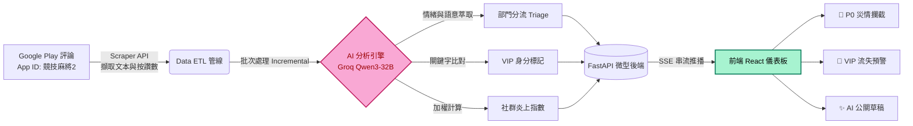

# 🎮 Player-Voice-Radar: 遊戲營運早期預警雷達

[](https://www.python.org/)
[](https://reactjs.org/)
[](https://fastapi.tiangolo.com/)
[-orange.svg)](https://groq.com/)
[](https://opensource.org/licenses/MIT)

> **「在遊戲上線前期或新活動初期，精準攔截 P0 級災情，守住核心 VIP 玩家。」**

`Player-Voice-Radar` 是一款專為遊戲營運團隊設計的 **AI 驅動即時監控儀表板**。本系統針對遊戲上線初期或新活動發布後的關鍵期，透過自動化資料管線（ETL）與大語言模型（LLM）語意分析，將海量玩家評論轉化為具備「部門權責分流」與「風險加權判定」的決策洞察。

---

## 🚀 核心價值與痛點解決

在遊戲上線或新活動初期，傳統的人工過濾已無法應付數據爆發帶來的決策延遲。本專案透過 AI 實現以下突破：

* **P0 級災情自動分流**：精準偵測「閃退、登入異常、扣款失敗」等致命 Bug，並將客訴自動歸類至正確的權責部門（工程、金流、企劃等），實現即時 Triage。
* **VIP 課長流失攔截**：利用語意分析技術，從文字中自動辨識「大老、長期課金、老玩家」等身分特徵，並針對高價值用戶的負評優先觸發警報。
* **社群共識指標整合**：導入 Google Play `thumbsUpCount`（按讚數）加權模型。將獲得大量共鳴的評論權重自動提升，防止潛在公關危機擴散。
* **營運工作流閉環**：不僅是數據展示，更提供「標記處理狀態」與「AI 公關回覆草稿」功能，縮短從災情發現到安撫解決的反應鏈。


## 🌊 系統資料流架構 (Data Pipeline)


---

## 🛠️ 技術棧 (Tech Stack)

### 後端 (Data & AI Pipeline)
* **API Framework**: FastAPI (支援異步處理)
* **Analysis Engine**: Qwen3-32B via **Groq Cloud** (極速推理，大幅降低管線延遲)
* **Optimization**: 實作增量更新（Incremental Update）邏輯，僅處理新產生的評論，極大化 Token 使用效率。
* **Real-time Streaming**: 使用 **SSE (Server-Sent Events)** 實作後端與前端的通信，即時推送 AI 批次處理進度。

### 前端 (Interactive Dashboard)
* **Core**: Vite + React + TypeScript
* **UI System**: **Shadcn UI** + **Tremor** (專業級數據可視化)
* **Visual Design**: 嚴格遵循 Vercel Dark Theme 高對比規範，針對營運場景優化長時間觀看的視覺舒適度。
* **Data Visualization**: 
    * 30 日動態時間序列聚合 (Time-series Aggregation)。
    * 雙維度（頻率 + 情緒）高對比文字雲編碼。

---

## ✨ 關鍵功能展示

### 1. 行動觸發指標卡 (Actionable Metrics)
* 🚨 **P0 級災情數**：工程與金流部門的首要戰報。
* 🔥 **社群炎上指數**：按讚數加權後的客訴壓力指標。
* 👑 **VIP 流失預警**：核心付費用戶的情緒監控指標。
* *支援點擊展開「30 天詳細趨勢圖」，協助決策者追蹤特定更新後的數據波動。*

### 2. 雙維度高對比文字雲 (BadgeCloud)
為了解決暗黑模式下的「警報疲勞」，我們優化了視覺編碼：
* **大小**：反映關鍵字出現頻率。
* **明度過渡**：採用「粉紅 ➔ 亮紅」代表負面，「淺綠 ➔ 亮綠」代表正面。避免低頻詞在黑底上隱形。

### 3. 營運協作與 AI Copilot
* **狀態管理**：每則評論可標記為「已處理」或「無效/忽略」，支援跨部門協作紀錄。
* **AI 公關草稿**：針對情緒化客訴，一鍵生成安撫性回覆，區分技術問題與情緒宣洩，提升客服效率。

---

## ⚙️ 快速開始 (Installation)

### 1. 後端啟動
```bash
cd backend
pip install -r requirements.txt
# 在 .env 中填入你的 GROQ_API_KEY
uvicorn main:app --reload --port 8000
```

### 2. 前端啟動
```bash
npm install
npm run dev
```

### 3. 展示/回溯功能
* 點擊 Header 右側的 🐞 瓢蟲按鈕：系統將自動回溯最新 10 筆資料並重置所有處理狀態，方便展示「增量更新」與「數據聯動」的完整流程。


---

## 📚 完整文檔與技術細節 (Deep Dive)

本專案不僅是一個展示工具，更具備完整的開發規範與技術深度。若您想進一步了解底層實作邏輯或進行二次開發，請參閱以下詳細文件：

* **[開發者上手指南](./docs/DEVELOPER_GUIDE.md)**：包含環境配置細節、API 接口定義、以及腳本手動執行參數。
* **[技術架構演進史 (Git Version Logs)](./gitversion/)**：紀錄從 v1.0 到 v2.2 的核心代碼異動、LLM Prompt 優化歷程與 Bug 修復紀錄。
* **[視覺設計規範 (DESIGN.md)](./docs/vercel/DESIGN.md)**：詳細定義了暗黑模式下的色彩編碼邏輯與 UX 互動規範。
* **[產品藍圖 (Project Blueprint)](./docs/project_blueprint.md)**：本專案的完整 URD 與商業邏輯推演過程。

---

本專案為應徵 鈊象電子 AI工程師/數據分析師 之實戰作品，僅供技術交流使用。