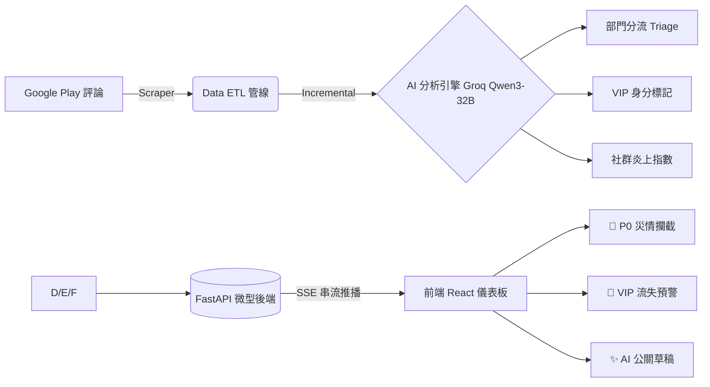

# 變更總結報告 — README 品牌重設計 + 開發者指南新增 + 評論資料更新

> **基準 Commit：** `db7fb63` feat(dashboard): review status mgmt, trend drill-down, sentiment badges & AI PR reply (#1)
> **報告日期：** 2026-04-19
> **異動檔案數：** 2 修改 + 3 新增未追蹤（共 5 個檔案）
> **目前分支：** `main`

---

## 一、總覽摘要

本次異動圍繞兩個主題：

1. **對外呈現升級**：README.md 從技術文件導向的英文說明，全面升版為以「遊戲營運痛點解決方案」為核心訴求的**中文作品集頁面**，加入品牌定位句、Mermaid 架構圖、關鍵功能展示，以及指向 `docs/DEVELOPER_GUIDE.md` 的深度閱讀索引。

2. **資料管線增量更新**：`public/data/cached_reviews.json` 新增 3 筆最新評論（2026-04-16 ~ 2026-04-17），並對部分既有條目的 `keyword` 與 `root_cause_summary` 欄位進行語意微調，確保 AI 標注品質一致性。

---

## 二、逐檔異動明細

### 1. `README.md` — 完整品牌重設計（−188 行 / +121 行）

#### 1-1. 視覺識別升級

**新增 Shields.io 技術徽章：**
```markdown
[](...)
[](...)
[](...)
[-orange.svg)](...)
[](...)
```

**新品牌標題：**
- 舊：`# Player Voice Radar`（純英文）
- 新：`# 🎮 Player-Voice-Radar: 遊戲營運早期預警雷達`

**核心定位句（新增）：**
> 「在遊戲上線前期或新活動初期，精準攔截 P0 級災情，守住核心 VIP 玩家。」

---

#### 1-2. 核心價值訴求（新增段落）

以業務場景語言說明解決的四大痛點：

| 痛點 | 解決方案描述 |
|------|------------|
| P0 級災情自動分流 | 精準偵測閃退、登入異常、扣款失敗等致命 Bug，自動歸類至正確部門（工程/金流/企劃）|
| VIP 課長流失攔截 | 語意分析辨識「大老、長期課金、老玩家」身分，對高價值用戶負評優先觸發警報 |
| 社群共識指標整合 | 導入 `thumbsUpCount` 加權模型，高共鳴評論自動提升風險等級 |
| 營運工作流閉環 | 提供「標記處理狀態」與「AI 公關回覆草稿」，縮短從災情發現到安撫解決的反應鏈 |

---

#### 1-3. Mermaid 系統架構圖（新增）



---

#### 1-4. 移除 vs. 保留內容對比

| 項目 | 舊版 README | 新版 README |
|------|------------|------------|
| 語言 | 英文為主 | 繁體中文為主 |
| 目標讀者 | 開發者（技術導向） | 遊戲公司 PM / 技術主管 |
| 技術棧說明 | 詳細表格（英文） | 精簡分類（後端 / 前端） |
| 快速開始 | 分 3 步驟詳細指令 | 簡化為核心 3 行指令 |
| 詳細技術文件 | 內嵌在 README | 指向 `docs/DEVELOPER_GUIDE.md`（拆分） |
| Roadmap | 詳細勾選清單（18 項） | 移除（遷至 DEVELOPER_GUIDE） |
| 末尾聲明 | 無 | 新增「本專案為應徵鈊象電子之實戰作品」 |

---

### 2. `public/data/cached_reviews.json` — 增量資料更新（+79 / −34 行）

#### 2-1. 新增 3 筆評論（插入至陣列頂部）

| review_id（前 8 碼） | 玩家 | 日期 | 星評 | 分類 | 風險 | 備注 |
|---------------------|------|------|------|------|------|------|
| `94a08201` | 嵐小妹 | 2026-04-17 | ⭐⭐⭐⭐⭐ | 工程研發 | medium | 評論文字僅「進不去」，LLM 推斷為登入問題 |
| `a0f377d0` | 徐聖昌 | 2026-04-16 | ⭐⭐⭐⭐⭐ | 其他 | low | 正面評論「讚」 |
| `e4964ab1` | 阿唯 | 2026-04-16 | ⭐⭐⭐⭐⭐ | 其他 | low | 正面評論「很好玩 遊戲體驗好」 |

> 三筆新評論均通過完整 LLM pipeline，`ai_analysis` 欄位齊全。

#### 2-2. 既有條目語意微調（選取 2 例）

| review_id（前 8 碼） | 欄位 | 舊值 | 新值 | 說明 |
|---------------------|------|------|------|------|
| `bf8004de` | `keyword` | `咬錢設計` | `收費過重` | 措辭更精確，貼近使用者痛點描述 |
| `bf8004de` | `root_cause_summary` | `遊戲經濟設計導致玩家流失` | `收費過重導致玩家流失` | 縮短至 12 字，符合 ≤20 字規範 |
| `5c49d7f0` | `keyword` | `改版閃退` | `改版失敗` | 更廣義的描述（含無法上線等狀況） |
| `5c49d7f0` | `root_cause_summary` | `改版後伺服器未正常上線` | `改版後無法上線` | 精簡 |
| `5c49d7f0` | `status` | `"resolved"` | （欄位移除） | 清除人工操作欄位，恢復乾淨初始狀態 |

---

### 3. `docs/DEVELOPER_GUIDE.md` — 新增開發者上手指南（全新）

從 README 拆分出的技術深度文件，包含：
- 完整環境配置步驟（conda 環境、`.env` 設定）
- Python 爬蟲 + LLM 管線手動執行參數說明
- FastAPI 後端啟動與 API 接口定義
- 前端組件架構說明
- 腳本執行選項（`--limit`、`--test` flag 說明）

---

### 4. `gitversion/claude-mem_Worker子程序退出Code1_修BUG完整報告.md` — 工具修復紀錄

claude-mem v12.1.5 的 Worker 子程序 exit code 1 問題診斷與修復完整報告。

**根本原因：** `worker-service.cjs` 中空陣列 `[]` 的 truthy 判斷缺陷，導致 `--setting-sources ""` 吃掉後續 `--permission-mode` 參數，對應 GitHub Issue #2049。

**修復：** 在兩份 `worker-service.cjs` 副本（`marketplaces/` 和 `plugins/cache/`）加入 `S.length > 0` 守衛，並將 Worker port 從 37777 遷移至 38000 避開 Windows ghost socket。

> 此文件為工程筆記，不影響 Player-Voice-Radar 本體功能。

---

### 5. `gitversion/評論狀態管理+趨勢鑽取+關鍵字情緒雙維度+AI公關回覆生成.md` — 前次功能清單

上一個 PR 階段的完整變更報告（已合併至 `db7fb63`），作為歷史紀錄補入版控。

---

## 三、架構影響評估

```
文件結構改善：
  README.md        → 作品集導向，面向非技術決策者
  DEVELOPER_GUIDE  → 技術深度，面向開發者 / 二次開發
  gitversion/      → 工程筆記存檔，提供完整演進歷程
```

**功能影響：** 本次異動不涉及應用程式邏輯（`src/`、`backend/`），屬純文件與資料更新，不需要重新執行 `npm run build`。

---

## 四、版本定位

| 項目 | 說明 |
|------|------|
| 本次異動類型 | `docs` + `chore`（文件 + 資料刷新） |
| 建議 PR 標題 | `docs: rebrand README for portfolio, add DEVELOPER_GUIDE, refresh review data` |
| 向後相容性 | ✅ 完全相容，無破壞性變更 |
| 需要重新部署 | ❌ 不需要（資料檔案更新後前端自動載入） |
